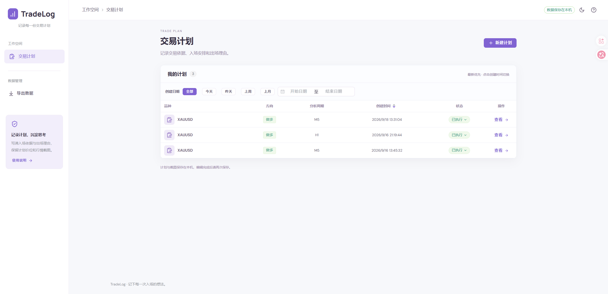

# TradeLog

一个在本机记录交易计划、关联订单、过程变化和计划复盘的个人交易日志。

TradeLog 只负责记录和整理，不连接交易账户，也不会执行任何交易。



## 可以做什么

- **记录交易计划**：保存品种、方向、分析周期、市场判断、入场与出场理由、计划价位和行情截图。
- **跟踪关联订单**：一份计划可以关联多笔订单；订单截图可在本机识别，也可以手动核对和录入。
- **回看计划变化**：自动记录订单的创建、状态变化，以及通过截图确认的手数、止损和止盈变化。
- **完成计划复盘**：记录计划是否成立、执行是否遵守纪律、复盘总结和下次行动。
- **快速查找计划**：按创建日期筛选，并可在日间与暗黑主题之间切换。
- **导出阅读资料**：把已保存计划及截图导出为 Markdown 与图片组成的 ZIP。

## 基本使用流程

1. 新建交易计划，写下交易依据和计划价位。
2. 计划保存后，在“关联订单”中录入实际发生的订单。
3. 订单发生变化时使用“更新订单”，核对手数、止损和止盈的变化。
4. 在“计划事件”中回看过程，在“计划复盘”中写下结论和下一次行动。

OCR 识别结果只是可编辑草稿，保存前应始终对照原始截图核对。订单截图仅用于本机识别，原图不会随订单保存。

## 本地运行

需要 **Node.js 22.13.0 或更高版本**。项目使用 Node.js 内置 SQLite，无需另外安装数据库。

```powershell
npm install
npm run dev
```

访问 [http://127.0.0.1:5173](http://127.0.0.1:5173)。开发命令会同时启动前端和本机 API；如果端口被占用，请以终端显示的地址为准。

构建并运行生产版本：

```powershell
npm run build
npm start
```

访问 [http://127.0.0.1:3001](http://127.0.0.1:3001)。服务只监听本机 `127.0.0.1`。

## 数据、隐私与备份

应用数据保存在项目根目录的 `data/trading.sqlite`，计划中的行情截图也保存在本地数据库中。数据库、真实交易截图和交易报告已排除在 Git 提交范围之外。

“导出数据”生成的 `交易计划.zip` 适合离线阅读和归档，但它不是数据库恢复包。需要迁移或备份时，请先停止应用，再完整复制整个 `data` 文件夹，包括可能存在的 `-wal` 和 `-shm` 文件。

## 技术栈

Vue 3 · TypeScript · Element Plus · Vite · Express · Node.js SQLite · Sharp · Tesseract.js
