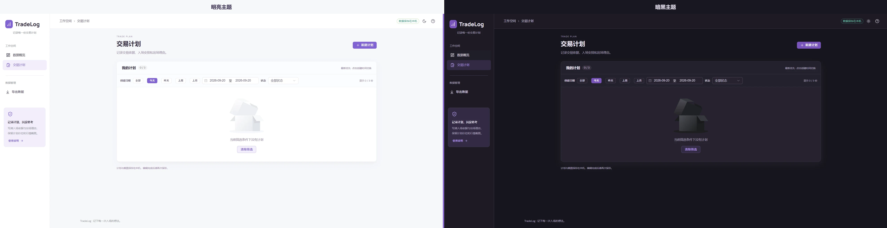

# TradeLog

一个在本机记录交易计划、关联订单、过程变化和计划复盘的个人交易日志。

TradeLog 只负责记录和整理，不连接交易账户，也不会执行任何交易。



## 可以做什么

- **查看数据概览**：从工作空间首页汇总计划、关联订单、已平仓订单和复盘，查看状态分布、常用品种和近期记录动态。
- **记录行情吐槽**：像时间线一样发布行情感想，帖子和每条回复都支持文字、图片或图文。
- **记录交易计划**：保存品种、方向、分析周期、市场判断、入场与出场理由、计划价位和行情截图。
- **跟踪关联订单**：一份计划可以关联多笔订单；订单截图可在本机识别，也可以手动核对和录入。
- **回看计划变化**：自动记录订单的创建、状态变化、锁定，以及通过截图确认的手数、止损和止盈变化。
- **完成计划复盘**：记录计划是否成立、执行是否遵守纪律、复盘总结和下次行动。
- **快速查找计划**：列表默认显示今天创建的计划，可按创建日期和计划状态组合筛选，并可在日间与暗黑主题之间切换。
- **导出阅读资料**：把全部已保存交易计划及截图导出为 HTML、Markdown 与原始图片组成的 ZIP，带目录和数量摘要，可离线阅读。

## 基本使用流程

打开应用默认进入“数据概览”，工作空间导航依次为“数据概览 → 交易计划 → 行情吐槽”。点击近期记录的“查看”可进入对应计划，或切换到“交易计划”继续新建和查找；计划列表仍默认显示今天创建的计划。

1. 新建交易计划，写下交易依据和计划价位。
2. 计划保存后，在“关联订单”中录入实际发生的订单。
3. 订单发生变化时使用“更新订单”，核对手数、止损和止盈的变化，并记录修改原因与当时情绪；已平仓订单核对完成后可永久锁定。
4. 在“计划事件”中回看过程，在“计划复盘”中写下结论和下一次行动。

OCR 支持完整宽度的浅色 MT5 固定表格，以及整行蓝色选中的单行截图；自动比较挂单、持仓中和已平仓布局，不支持任意深色主题或任意表格。识别结果只是可编辑草稿，保存前应始终对照原始截图核对。订单截图仅用于本机识别，原图不会随订单保存。

关联订单列表展示“盈亏比”和“锁定状态”。盈亏比按订单当前的止盈距离 / 止损距离计算（例如 `2.35 : 1`），不计交易成本，也不代表实际盈利。止损移动到开仓价另一侧后仍按当前价格距离计算；三个价格必须为正数且有限，止损距离为零或缺少字段时显示 `—`。导出资料采用相同口径。

只有已平仓订单可以点击“锁定订单”，并需再次确认。锁定后订单视为完结，永久禁止修改状态、手数、止损和止盈，不提供解锁；仍可查看和导出。未平仓订单显示“待平仓”。锁定会记录时间和计划事件；订单已在其他页面更新时，需要重新加载后再次确认。

## 行情吐槽

在工作空间打开“行情吐槽”，写下此刻的行情感想，或直接选择、粘贴图片后点击“发布吐槽”。文字最多 2000 字；每条最多 4 张 PNG、JPEG 或 WebP 图片，每张不超过 5 MB。纯文字、纯图片和图文均可发布，不能发布空记录。待发布图片可移除，也可点击放大预览。

已发布内容按创建时间倒序排列，每页显示 10 条，翻页时从本机数据库读取该页；页数按全部帖子计算。帖子展示完整日期、时间和图片，点击图片可放大查看。每条帖子下可发布纯文字、纯图片或图文回复：文字最多 500 字且去除首尾空白，图片最多 4 张 PNG、JPEG 或 WebP，每张不超过 5 MB；至少填写文字或添加一张图片。回复框支持选图和粘贴，待发布图片可预览、移除；已发布图片可放大查看。回复按发表时间从早到晚完整展示，不支持多层回复。

“刷新时间线”重新读取当前页，不会清空正在填写的草稿；新帖子发布后回到第一页。帖子和回复发布失败时均保留输入，翻页也会按帖子保留尚未发布的回复文字与图片。切换工作空间板块会一起提示未发布的帖子和回复草稿，刷新或关闭页面由浏览器提示；发布进行中暂时不能切换。

行情吐槽是独立于交易计划的本地个人时间线，没有账号或点赞，帖子和回复均不提供编辑或删除。正文和图片一同存入本地数据库，图片保持原图。它不纳入数据概览的计划统计，也不包含在交易计划导出 ZIP 中；完整备份仍需复制整个 `data` 文件夹。

## 数据概览的统计口径

数据概览统计本机全部已保存计划及其关联记录，不受交易计划列表的日期或状态筛选影响。进入页面时读取最新数据，也可点击“刷新数据”手动更新；页面显示本次读取时间，刷新失败时会明确保留上次结果。

- 交易计划按当前状态统计；关联订单只包含已关联到现有计划的独立订单，同一订单只计一次。已平仓和已锁定数量沿用订单的当前状态与锁定记录。
- 已完成复盘指至少保存一项复盘内容的计划。复盘覆盖率为已完成复盘的计划数除以全部已保存计划数，包含草稿和未执行计划；并不表示所有复盘字段均已填满。
- 常用品种按计划数量显示前 5 名，占比的分母为全部计划。品种忽略首尾空格并按大写归类，未填写品种的计划单独提示。
- 近期记录动态展示最近有活动的 6 份计划，活动时间取计划、关联订单、计划事件和复盘中的最新记录时间。计划事件总数只统计已有事件，不补造历史。

未保存输入、OCR 识别草稿和订单更新草稿不计入统计。看板不计算账户收益、胜率或余额，不对未知盈亏作推算。

## 本地运行

需要 **Node.js 22.13.0 或更高版本**。项目使用 Node.js 内置 SQLite，无需另外安装数据库。

```powershell
npm install
npm run dev
```

访问 [http://127.0.0.1:5173](http://127.0.0.1:5173)。开发命令会同时启动前端和本机 API；如果端口被占用，请以终端显示的地址为准。

构建并运行生产版本：

```powershell
npm run build
npm start
```

访问 [http://127.0.0.1:3001](http://127.0.0.1:3001)。服务只监听本机 `127.0.0.1`。

## 数据、隐私与备份

应用数据保存在项目根目录的 `data/trading.sqlite`，计划中的行情截图以及行情吐槽帖子和回复的文字、图片也保存在本地数据库中。数据库、真实交易截图和交易报告已排除在 Git 提交范围之外。

点击“导出数据”会打开范围说明弹窗，点击“下载 ZIP”生成带导出时间的 `交易计划_YYYYMMDD_HHmmssSSSZ.zip`（UTC）。导出期间显示忙碌状态，失败可在弹窗内重试；打开弹窗和下载会保留当前工作空间的未保存输入。

ZIP 覆盖全部已保存交易计划，包含全部状态，不受列表日期、状态筛选和分页影响。每份计划包含当前计划内容、原始行情截图、关联订单、倒序计划事件（含修改原因和当时情绪）及最新复盘。未保存输入、行情吐槽与回复、订单 OCR 原图、识别或更新草稿及识别元数据不在导出范围内。

完整解压 ZIP 后，用浏览器打开 `交易计划.html`，即可通过目录离线回看；页面随浏览器日夜主题调整，也可打印。用 Markdown 阅读器打开 `交易计划.md` 同样可以阅读。请保留 `images/` 文件夹与两个文件的相对位置，以显示截图。应用时间使用 ISO UTC 格式，订单报告时间保留报告时钟原文，不转换时区。

ZIP 是阅读和归档资料，不提供导入功能，也不能恢复数据库。需要迁移或备份时，请先停止应用，再完整复制整个 `data` 文件夹，包括可能存在的 `-wal` 和 `-shm` 文件。

首次运行含订单锁定功能的版本前，请按上述方式停服并完整备份 `data`。启动时只为订单表补充可空的 `locked_at` 列，已有订单保持未锁定，不删除或重建数据。旧版本可忽略新增列并读取原有字段，但不具备锁定保护；需要保留锁定约束时请继续使用本版本。若必须恢复升级前状态，停服后使用完整备份恢复整个 `data` 目录，并保留升级后的目录以便回退；升级后的新记录不会包含在旧备份内。

首次运行含行情吐槽功能的版本前，同样先停服并完整备份 `data`（已有数据时）。新版本只追加创建 `market_rants_v1`、`market_rant_images_v1` 两张独立表及索引，不删除、重建或修改原有表。旧版本会忽略新表，仍可使用原有计划数据，但无法查看吐槽；保留升级后的整个数据目录即可让新版本再次读取。若恢复升级前备份，须先停服并保留升级后的完整目录，再恢复整个 `data`，因为旧备份不含新发布的吐槽。

首次运行含回复功能的版本前也应先停服并完整备份 `data`。启动时只追加创建 `market_rant_replies_v1` 表及索引，不修改已有帖子和图片。旧版本会忽略回复表，也无法显示回复；保留升级后的整个数据目录可供新版本再次读取。若恢复旧备份，先停服并保留升级后的完整目录，旧备份不会包含之后发表的回复。

首次运行含回复图片功能的版本前，同样须停服并完整备份 `data`。新版只追加创建 `market_rant_reply_images_v1` 表和索引，不修改已有回复；旧回复照常显示。旧版本无法显示回复图片，恢复旧备份前请保留升级后的完整 `data` 目录，旧备份不包含之后发表的回复和图片。

## 技术栈

Vue 3 · TypeScript · Element Plus · Vite · Express · Node.js SQLite · Sharp · Tesseract.js
